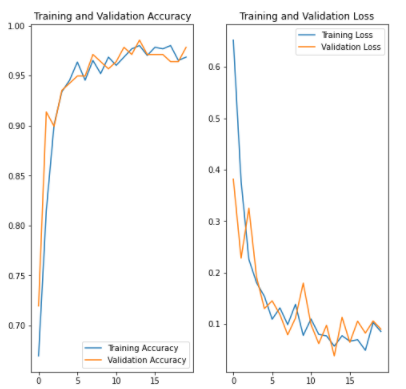

# CarrotParsnipCNN
Python 3
TensorFlow 2.4.1

This project shows the creation and training of a Convolutional Neural Network (CNN) for a Carrot or Parsnip classifier. The rootvegclassifier.py & RootVegClassifier.ipynb file follows the loading of the self curated dataset, image augmentations to counteract overfitting, the model definition and the training process. 

Graphed visualisations of the training and validation results can be seen here but also found at the bottom of the python notebook.

The dataset is zipped and included. I do not own the rights to the images included, they are used for educational purposes.

The trained model can be found within the TrainedModel folder.
